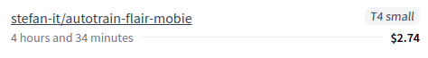
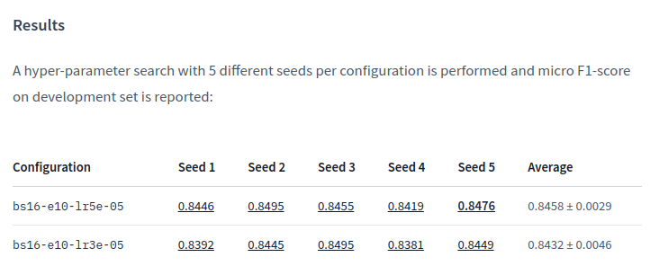
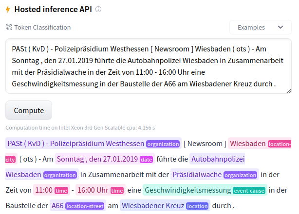

# Fine-tune Flair Models on German MobIE Dataset with 🤗 AutoTrain SpaceRunner

This repository shows how to fine-tune Flair models on the [German MobIE](https://aclanthology.org/2021.konvens-1.22/)
NER dataset using the awesome 🤗 [AutoTrain](https://github.com/huggingface/autotrain-advanced) library with
[SpaceRunner](https://twitter.com/abhi1thakur/status/1697165317452026363).

## Dataset

The [German MobIE](https://github.com/DFKI-NLP/MobIE) dataset is a German-language dataset, which is human-annotated
with 20 coarse- and fine-grained entity types and entity linking information for geographically linkable entities. The
dataset consists of 3,232 social media texts and traffic reports with 91K tokens, and contains 20.5K annotated
entities, 13.1K of which are linked to a knowledge base.

The following named entities are annotated:

* `location-stop`
* `trigger`
* `organization-company`
* `location-city`
* `location`
* `event-cause`
* `location-street`
* `time`
* `date`
* `number`
* `duration`
* `organization`
* `person`
* `set`
* `distance`
* `disaster-type`
* `money`
* `org-position`
* `percent`

In order to use MobIE in Flair, a custom dataset reader is implemented in [`mobie_dataset.py`](mobie_dataset.py).
Adding native support for MobIE in Flair is coming soon!

## Fine-Tuning

The main fine-tuning is done in [`experiment.py`](experiment.py).

Fine-tuning can be started by calling the `run_experiment()` method and passing a so called `ExperimentConfiguration`.
In `ExperimentConfiguration` all necessary hyper-parameters and fine-tuning options are stored. The interface looks
like:

```python
class ExperimentConfiguration:
    batch_size: int
    learning_rate: float
    epoch: int
    context_size: int
    seed: int
    base_model: str
    base_model_short: str
    layers: str = "-1"
    subtoken_pooling: str = "first"
    use_crf: bool = False
    use_tensorboard: bool = True
```

## AutoTrain

A hyper-parameter search grid is defined in [`script.py`](script.py). This file is later called to start the training process using [AutoTrain](https://github.com/huggingface/autotrain-advanced) library.

More precisely, [AutoTrain](https://github.com/huggingface/autotrain-advanced) with
[SpaceRunner](https://twitter.com/abhi1thakur/status/1697165317452026363) is used to start the training with:

```bash
$  export HF_TOKEN="<HF_TOKEN>" # Get token from: https://huggingface.co/settings/tokens
$ autotrain spacerunner --project-name "flair-mobie" \
  --script-path $(pwd) \
  --username stefan-it \
  --token $HF_TOKEN \
  --backend spaces-t4s\
  --env "HF_TOKEN=$HF_TOKEN;HUB_ORG_NAME=stefan-it"
```

Training of all 10 models on MobIE dataset took 4 hours and 34 minutes on a T4 small instance and costs 2.74$ in total:



## Hyper-Parameter Search

In this example the following hyper-parameter search grid is used:

* Batch Sizes = `[16]`
* Learning Rates = `[3e-05, 5e-05]`
* Seeds = `[1, 2, 3, 4, 5]`

This means 10 models will be fine-tuned in total (1 x 2 x 5 = 10). The hyper-parameter search grid can easily be extended.

## Model Upload

After each model is fine-tuned, it will automatically be uploaded to the Hugging Model Hub. The following files are uploaded:

* `pytorch-model.bin`: Flair internally tracks the best model as `best-model.pt` over all epochs. To be compatible with the Model Hub the `best-model.pt`, is renamed automatically to `pytorch_model.bin`
* `training.log`: Flair stores the training log in `training.log`. This file is later needed to parse the best F1-score on development set
* `./runs`: In this folder the TensorBoard logs are stored. This enables a nice display of metrics on the Model Hub

## Model Card

Additionally, this repository shows how to automatically generate model cards for all uploaded models. This includes
also a results overview table with linked models, that looks like:



The [`Example.ipynb`](Example.ipynb) notebook gives a detailed overview of all necessary steps.

## Fine-tuned Models

All fine-tuned models for this tutorial are available on the Hugging Face Model Hub incl. a working inference widget that allows to perform NER:



Here's an overview of all fine-tuned models:

* https://hf.co/stefan-it/autotrain-flair-mobie-gbert_base-bs16-e10-lr5e-05-1
* https://hf.co/stefan-it/autotrain-flair-mobie-gbert_base-bs16-e10-lr5e-05-2
* https://hf.co/stefan-it/autotrain-flair-mobie-gbert_base-bs16-e10-lr5e-05-3
* https://hf.co/stefan-it/autotrain-flair-mobie-gbert_base-bs16-e10-lr5e-05-4
* https://hf.co/stefan-it/autotrain-flair-mobie-gbert_base-bs16-e10-lr5e-05-5
* https://hf.co/stefan-it/autotrain-flair-mobie-gbert_base-bs16-e10-lr3e-05-1
* https://hf.co/stefan-it/autotrain-flair-mobie-gbert_base-bs16-e10-lr3e-05-2
* https://hf.co/stefan-it/autotrain-flair-mobie-gbert_base-bs16-e10-lr3e-05-3
* https://hf.co/stefan-it/autotrain-flair-mobie-gbert_base-bs16-e10-lr3e-05-4
* https://hf.co/stefan-it/autotrain-flair-mobie-gbert_base-bs16-e10-lr3e-05-5

# Changelog

* 19.10.2023: Initial version of this repository.
